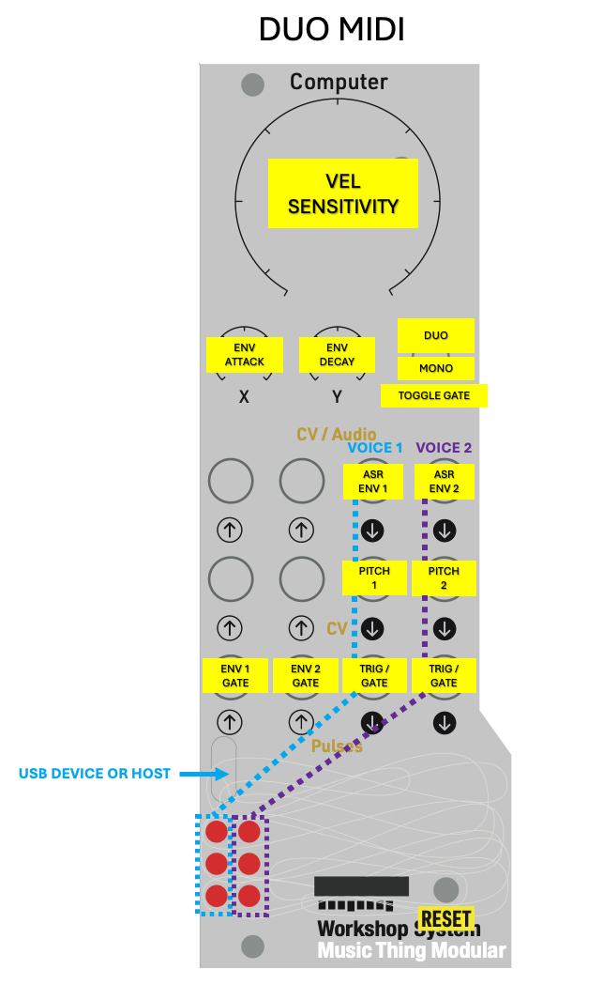

# Duo MIDI

A duophonic MIDI-to-CV + envelope card! The first ever card released using Blackbird as a platform under the hood.

Customize the behavior to make your own midi card by opening the duo_midi.lua file in [web-druid](https://dessertplanet.github.io/web-druid/). Note this script is big so you need to use the **upload** button in web-druid. for some reason **run** doesn't.

The version of blackbird included in the UF2 (version 1.1M) is technically unreleased at the time of writing because I haven't tested much blackbird functionality other than this script (so if you load a different script onto it, YMMV).

## What it does

- Receives MIDI note, velocity, pitch bend, and CC (mod wheel).
- Outputs **two pitches** (duophonic or mirrored mono).
- Outputs **two ASR envelopes** (at the audio outputs).
- Outputs **two triggers / gates** on voice assignment.

## Controls

### Switch

- **Up**: **Duophonic** (two voices, dynamically assigned).
- **Middle**: **Monophonic** (both channels mirror the same note).
- **Down**: Toggles **gate mode** for pulse outputs.
  - Gate mode **off** (default): pulse outputs emit a **10ms trigger** on voice assignment.
  - Gate mode **on**: pulse outputs behave like **gates** (high while the voice is active).

Note: Device/Host mode switching is automatic, but changing it requires a **Workshop Computer power cycle**.

### Knobs

- **Main**: Velocity sensitivity (scales envelope level by MIDI velocity).
- **X**: Envelope **attack**.
- **Y**: Envelope **release**.

## MIDI behavior

- **Pitch bend**: ±2 semitones (configurable in code via `BEND_RANGE`).
- **Mod wheel (CC #1)**: Sets pitch slew on outputs 1–2 from 0 to 1 second.

## Voice allocation (duophonic)

When two voices are active, new notes get assigned to the closest existing voice (by pitch distance). When only one voice is active, notes within ~5 semitones tend to reuse the nearby voice; otherwise they take the other voice.
